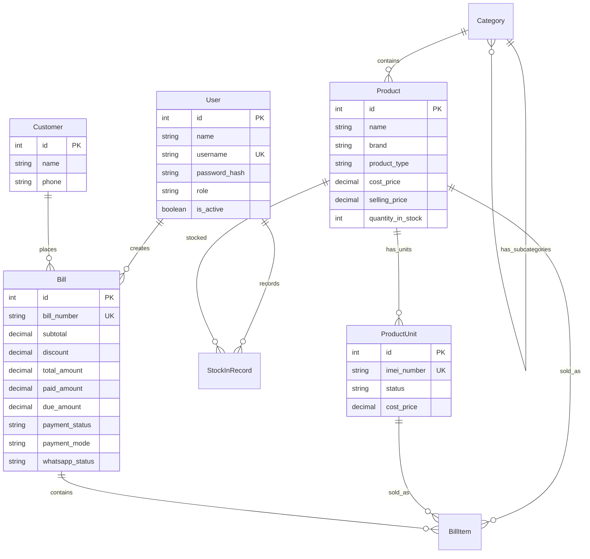

<p align="center">
  
  
  
  
  
</p>

# 🏪 Shree Krishna Computer — POS, Inventory & Billing System

> A production-grade, full-stack **Point of Sale (POS)** system built for a retail electronics shop. Manages inventory, generates GST-compliant invoices, tracks due payments, sends WhatsApp receipts, and provides real-time sales analytics — all from a single dashboard.

---

## ✨ Key Highlights

| Feature | Description |
|---|---|
| **Live Invoice Preview** | See the invoice update in real-time as you add products, taxes, and discounts |
| **GST-Compliant Billing** | SGST, CGST, IGST support with automatic tax calculation |
| **Due Payment Tracking** | Partial payments, overdue reminders, and one-click settlement |
| **WhatsApp Integration** | Auto-send PDF invoices to customers via WhatsApp (Baileys) |
| **Role-Based Access** | Owner and Staff roles with fine-grained permissions |
| **Sales Analytics** | Interactive charts, CSV/Excel export, and revenue dashboards |
| **IMEI Tracking** | Serialized product management with unique IMEI per unit |

---

## 📐 Architecture

```
┌─────────────────────────────────────────────────────┐
│                    Next.js 16 (App Router)           │
│  ┌────────────┐  ┌────────────┐  ┌────────────────┐ │
│  │  React 19   │  │  API Routes │  │  Middleware     │ │
│  │  (Frontend) │  │  (Backend)  │  │  (Auth + RBAC) │ │
│  └──────┬─────┘  └──────┬─────┘  └────────┬───────┘ │
│         │               │                  │         │
│  ┌──────┴───────────────┴──────────────────┴───────┐ │
│  │              Prisma ORM (SQLite)                 │ │
│  └──────────────────────────────────────────────────┘ │
│  ┌──────────────────────────────────────────────────┐ │
│  │        WhatsApp Daemon (Baileys)                  │ │
│  └──────────────────────────────────────────────────┘ │
└─────────────────────────────────────────────────────┘
```

| Layer | Technology |
|---|---|
| **Framework** | Next.js 16 (App Router) |
| **UI** | React 19, Tailwind CSS 4, Recharts |
| **Backend** | Next.js API Routes (RESTful) |
| **Database** | SQLite via Prisma ORM 6 |
| **Auth** | NextAuth.js (JWT + Credentials Provider) |
| **PDF Generation** | jsPDF + html2canvas |
| **WhatsApp** | @whiskeysockets/baileys |
| **Export** | ExcelJS (CSV/XLSX) |
| **Validation** | Zod |

---

## 🚀 Features

### 🧾 POS Billing Terminal
- **Real-time invoice preview** — a live bill updates as you scan products and adjust quantities.
- **Smart customer lookup** — enter a phone number and auto-fill customer details from history.
- **Title-case name formatting** — customer names are automatically capitalised (e.g. `vishal menariya` → `Vishal Menariya`).
- **Flexible payment modes** — Cash, UPI, Card, or Bank Transfer.
- **Partial payments** — accept partial amounts; remaining balance is tracked as due.
- **GST calculations** — configurable SGST, CGST, and IGST with automatic tax computation.
- **Discount support** — flat discount applied before tax.
- **Print-ready invoices** — branded Tax Invoice with GSTIN, owner details, and amount in words.
- **Auto WhatsApp delivery** — PDF invoice is generated and queued for WhatsApp delivery on checkout.

### 📦 Inventory Management
- **Category hierarchy** — parent and sub-category organization.
- **Dual product types**:
  - *Quantity-based* — for accessories (chargers, cables, etc.).
  - *Serialized (IMEI)* — for electronics (phones, laptops) with per-unit IMEI tracking.
- **Stock-in workflows** — add stock with cost price recording and audit trail.
- **Low stock alerts** — configurable thresholds with dashboard warnings.
- **IMEI duplicate prevention** — unique constraint enforced at the database level.
- **Cost price masking** — staff users never see purchase prices.

### 💰 Due Payment Tracking
- **Due payments page** — filterable list of all customers with outstanding balances.
- **15-day overdue alerts** — dashboard component highlights bills unpaid for 15+ days.
- **One-click settlement** — checkbox with confirmation dialog to mark dues as paid.
- **WhatsApp reminders** — send payment reminders directly from the due payments list.
- **Phone call integration** — tap-to-call for quick follow-ups.
- **Automatic bill promotion** — settled bills move from due payments to billing history.

### 📊 Sales Analytics (Owner Only)
- **Revenue dashboard** — daily, weekly, and monthly revenue summaries.
- **Interactive charts** — sales trends visualised with Recharts.
- **Export to Excel/CSV** — download transaction data for accounting.
- **Staff performance tracking** — bills created per staff member.

### 📱 WhatsApp Integration
- **Automated invoice delivery** — PDF invoices sent to customers on checkout.
- **QR code pairing** — connect WhatsApp via QR scan from the dashboard.
- **Delivery tracking** — status logged per bill (`pending`, `sent`, `failed`).
- **Audit logging** — every WhatsApp event is recorded for traceability.
- **Background daemon** — non-blocking delivery via queue-based architecture.

### 🔐 Security & Access Control
- **Role-based access (RBAC)** — Owner and Staff with distinct permissions.
- **Protected API routes** — middleware enforces authentication and authorization.
- **Bcrypt password hashing** — industry-standard credential security.
- **JWT sessions** — stateless, secure session management.
- **Cost price protection** — sensitive financial data hidden from staff at the API level.

---

## 📁 Project Structure

```
mobile-shop/
├── app/
│   ├── (dashboard)/
│   │   ├── analytics/          # Sales analytics (Owner only)
│   │   ├── billing/
│   │   │   ├── page.tsx        # POS billing terminal
│   │   │   ├── history/        # Bill history & reprint
│   │   │   └── [id]/           # Individual bill detail
│   │   ├── dashboard/          # Main dashboard with alerts
│   │   ├── due-payments/       # Due payment tracking
│   │   ├── inventory/          # Product & stock management
│   │   ├── staff-management/   # User management (Owner only)
│   │   └── layout.tsx          # Sidebar navigation layout
│   ├── api/v1/
│   │   ├── analytics/          # Charts, stats, export endpoints
│   │   ├── bills/              # Bill CRUD + WhatsApp upload
│   │   ├── categories/         # Category management
│   │   ├── customers/          # Customer lookup & creation
│   │   ├── dashboard/          # Dashboard notifications
│   │   ├── due-payments/       # Due payment list & settlement
│   │   ├── products/           # Product CRUD + stock operations
│   │   ├── users/              # Staff management (Owner only)
│   │   └── whatsapp/           # Settings & delivery stats
│   └── login/                  # Authentication page
├── lib/
│   ├── api/                    # Client-side API helpers
│   ├── auth.ts                 # NextAuth configuration
│   ├── client-pdf.ts           # Invoice PDF generation
│   ├── format.ts               # Name formatting utilities
│   ├── prisma.ts               # Prisma client singleton
│   ├── whatsapp.ts             # WhatsApp service layer
│   └── whatsapp-daemon.ts      # Background delivery daemon
├── hooks/                      # React custom hooks
├── components/                 # Shared UI components
├── prisma/
│   ├── schema.prisma           # Database schema
│   └── seed.ts                 # Initial data seeder
├── middleware.ts               # Auth + RBAC middleware
└── types/                      # TypeScript type definitions
```

---

## 🗄️ Database Schema



---

## 🛠️ API Reference

### Authentication
| Method | Endpoint | Description | Access |
|--------|----------|-------------|--------|
| `POST` | `/api/auth/[...nextauth]` | Credential login & JWT session | Public |

### Inventory
| Method | Endpoint | Description | Access |
|--------|----------|-------------|--------|
| `GET` | `/api/v1/categories` | List active categories | All |
| `POST` | `/api/v1/categories` | Create category | Owner |
| `GET` | `/api/v1/products` | List products (filtered, searchable) | All* |
| `POST` | `/api/v1/products` | Create product | Owner |
| `GET` | `/api/v1/products/[id]` | Get product detail | All* |
| `PUT` | `/api/v1/products/[id]` | Update product | Owner |
| `DELETE` | `/api/v1/products/[id]` | Soft-delete product | Owner |
| `POST` | `/api/v1/products/[id]/stock` | Add stock (quantity or IMEI) | Owner |

> \* *Cost prices are masked for Staff role at the API level.*

### Billing
| Method | Endpoint | Description | Access |
|--------|----------|-------------|--------|
| `GET` | `/api/v1/bills` | List bills (paginated, searchable) | All |
| `POST` | `/api/v1/bills` | Create new bill | All |
| `GET` | `/api/v1/bills/[id]` | Get bill detail | All |
| `PATCH` | `/api/v1/bills/[id]/void` | Void a bill | Owner |
| `POST` | `/api/v1/bills/[id]/whatsapp/upload` | Upload PDF & queue WhatsApp | All |

### Customers
| Method | Endpoint | Description | Access |
|--------|----------|-------------|--------|
| `GET` | `/api/v1/customers?phone=` | Lookup customer by phone | All |
| `POST` | `/api/v1/customers` | Create/update customer | All |

### Due Payments
| Method | Endpoint | Description | Access |
|--------|----------|-------------|--------|
| `GET` | `/api/v1/due-payments` | List bills with outstanding dues | All |
| `PATCH` | `/api/v1/due-payments/[id]/settle` | Settle a due payment | All |

### Analytics
| Method | Endpoint | Description | Access |
|--------|----------|-------------|--------|
| `GET` | `/api/v1/analytics/stats` | Revenue & sales statistics | Owner |
| `GET` | `/api/v1/analytics/charts` | Chart data for trends | Owner |
| `GET` | `/api/v1/analytics/export` | Export bills as Excel/CSV | Owner |

### WhatsApp
| Method | Endpoint | Description | Access |
|--------|----------|-------------|--------|
| `GET` | `/api/v1/whatsapp/settings` | Get connection status | All |
| `POST` | `/api/v1/whatsapp/settings` | Update WhatsApp settings | Owner |
| `GET` | `/api/v1/whatsapp/stats` | Delivery statistics | All |

### Staff Management
| Method | Endpoint | Description | Access |
|--------|----------|-------------|--------|
| `GET` | `/api/v1/users` | List staff members | Owner |
| `POST` | `/api/v1/users` | Create staff account | Owner |

---

## ⚡ Quick Start

### Prerequisites
- **Node.js** ≥ 18
- **npm** ≥ 9

### Installation

```bash
# 1. Clone the repository
git clone https://github.com/menariyavishal/Inventory-and-Billing-System.git
cd Inventory-and-Billing-System/mobile-shop

# 2. Install dependencies
npm install

# 3. Configure environment
cp .env.example .env
# Ensure DATABASE_URL="file:./dev.db" is set

# 4. Initialize the database
npx prisma migrate dev

# 5. Seed default users
npx tsx prisma/seed.ts

# 6. Start the development server
npm run dev
```

Open [http://localhost:3000](http://localhost:3000) and log in:

| Role | Username | Password |
|------|----------|----------|
| Owner | `admin` | `password123` |
| Staff | `staff` | `password123` |

---

## 🔒 Security

| Measure | Implementation |
|---------|----------------|
| **Password Hashing** | bcryptjs with salt rounds |
| **Session Management** | JWT tokens via NextAuth.js |
| **Route Protection** | Middleware-level auth + RBAC checks |
| **Data Isolation** | Cost prices filtered at API layer for Staff |
| **Input Validation** | Zod schemas for request validation |
| **CSRF Protection** | Built-in NextAuth.js CSRF tokens |

---

## 📋 Changelog

### v0.4.0 — Due Payments & Bug Fixes
- Added **Due Payment Tracking** page with search, filter, and settlement workflow.
- Added **15-day overdue alert** component on the dashboard.
- Added **WhatsApp reminder** and **phone call** integration on due payments.
- Fixed `toFixed is not a function` crash on invoice generation (Prisma Decimal handling).
- Fixed customer name truncation — phone search no longer overwrites user-typed names.
- Added automatic **Title Case formatting** for customer names.
- Form fields now persist until the print modal is closed.

### v0.3.0 — Billing & WhatsApp
- Implemented full **POS Billing Terminal** with live invoice preview.
- Added **GST tax calculations** (SGST, CGST, IGST).
- Implemented **print-ready branded invoices** with GSTIN and amount in words.
- Built **Bill History** page with search and reprint capability.
- Integrated **WhatsApp invoice delivery** via Baileys daemon.
- Added **Sales Analytics** dashboard with Recharts and Excel export.
- Implemented **Staff Management** (Owner only).

### v0.2.0 — Inventory
- Implemented category and product CRUD with SQLite-compatible Prisma queries.
- Built Inventory page with search and category filters.
- Added stock-in workflows (quantity-based and IMEI serialized).
- Enforced cost price masking at the API layer for Staff role.

### v0.1.0 — Foundation
- Initialized Next.js project with Tailwind CSS.
- Configured Prisma with SQLite local database.
- Implemented NextAuth credentials provider with JWT.
- Added database schema models and seed file.
- Created protected dashboard layout with sidebar navigation.

---

## 🗺️ Roadmap

- [ ] **Barcode/QR scanning** for faster product lookup
- [ ] **Multi-store support** with centralized analytics
- [ ] **Cloud deployment** (Vercel + Supabase/PostgreSQL)
- [ ] **SMS fallback** for WhatsApp delivery failures
- [ ] **Bulk payment reminders** for overdue accounts
- [ ] **Purchase order management** for suppliers
- [ ] **Profit margin reports** per product/category

---

## 📄 License

This project is private and proprietary. All rights reserved.

---

<p align="center">
  Built with ❤️ for <strong>Shree Krishna Computer, Kanore</strong>
</p>
