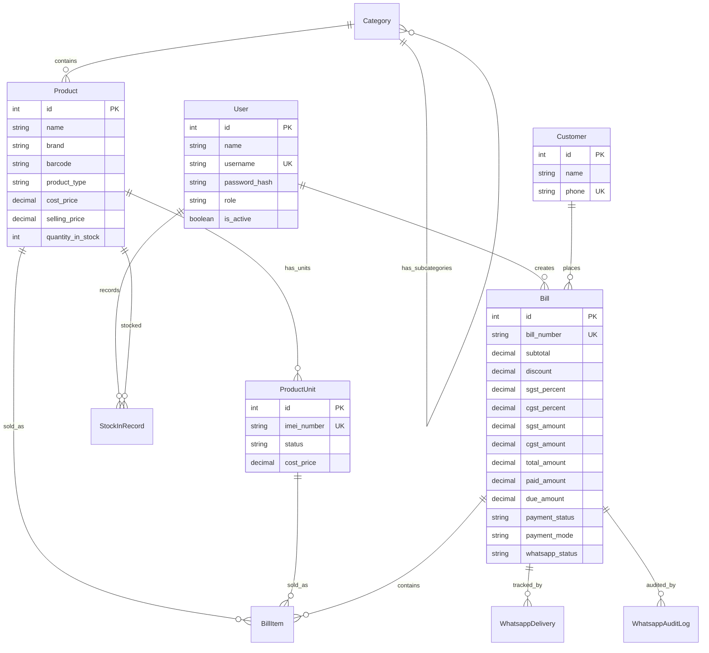

<p align="center">
  
  
  
  
  
  
</p>

<h1 align="center">🏪 Shree Krishna Computer</h1>
<h3 align="center">POS · Inventory · Billing · WhatsApp Integration</h3>

<p align="center">
  A production-grade, full-stack <strong>Point of Sale</strong> system built for a retail electronics shop.<br/>
  Manages inventory, generates GST-compliant invoices, tracks due payments,<br/>
  sends WhatsApp receipts, and provides real-time sales analytics — all from a single dashboard.
</p>

---

## ✨ Feature Highlights

| Module | Capabilities |
|:---|:---|
| **POS Billing Terminal** | Real-time invoice preview · Smart product search · Barcode/camera scanning · GST tax computation · Partial payments · UPI QR display |
| **Inventory Management** | Category hierarchy · Quantity & serialized (IMEI) product types · Stock-in workflows · Low stock alerts · Cost price masking |
| **Invoice Engine** | Branded Tax Invoice PDF · Unified template (screen + PDF) · Print-ready layout · Amount in words · WhatsApp auto-delivery |
| **Due Payments** | Outstanding balance tracker · 15-day overdue alerts · One-click settlement · WhatsApp reminders · Tap-to-call |
| **Finance Tracking** | EMI/Finance provider management · Financed bill tracking · Provider-wise records |
| **Sales Analytics** | Revenue dashboards · Interactive Recharts · CSV/Excel export · Staff performance metrics |
| **WhatsApp Bot** | QR code pairing · Auto PDF delivery · Delivery status tracking · Audit logging · Background daemon |
| **Security** | Role-based access (Owner/Staff) · JWT sessions · Bcrypt hashing · API-level data isolation |

---

## 📐 System Architecture

```
┌──────────────────────────────────────────────────────────────┐
│                     Vercel (Serverless)                      │
│                                                              │
│   ┌──────────────┐   ┌──────────────┐   ┌────────────────┐  │
│   │   React 19    │   │  API Routes  │   │   Middleware    │  │
│   │  (Frontend)   │   │  (Backend)   │   │  (Auth + RBAC) │  │
│   └──────┬───────┘   └──────┬───────┘   └───────┬────────┘  │
│          │                  │                    │            │
│   ┌──────┴──────────────────┴────────────────────┴────────┐  │
│   │            Neon PostgreSQL via Prisma ORM              │  │
│   └────────────────────────────────────────────────────────┘  │
└─────────────────────────────────────────────┬────────────────┘
                                              │ HTTP + Base64 PDFs
┌─────────────────────────────────────────────▼────────────────┐
│                     Railway (Container)                      │
│                                                              │
│   ┌──────────────────────────────────────────────────────┐  │
│   │          WhatsApp Microservice (Express.js)           │  │
│   │              (@whiskeysockets/baileys)                │  │
│   └──────────────────────────────────────────────────────┘  │
└──────────────────────────────────────────────────────────────┘
```

### Technology Stack

| Layer | Technology |
|:---|:---|
| **Framework** | Next.js 16 (App Router, Turbopack) |
| **UI** | React 19 · Tailwind CSS 4 · Recharts · React Icons |
| **Backend** | Next.js API Routes (Serverless) |
| **Database** | Neon PostgreSQL via Prisma ORM 6 |
| **Auth** | NextAuth.js (JWT + Credentials Provider) |
| **PDF Generation** | jsPDF + html2canvas-pro |
| **WhatsApp Engine** | @whiskeysockets/baileys (Standalone Express.js Microservice) |
| **Export** | ExcelJS (CSV / XLSX) |
| **Validation** | Zod |
| **Scanning** | html5-qrcode (Camera barcode reader) |

---

## 🚀 Module Deep-Dive

### 🧾 POS Billing Terminal

> `/billing` — The heart of the system. A complete point-of-sale terminal with real-time invoice rendering.

- **Real-time invoice preview** — a live bill updates instantly as products are added, quantities adjusted, and taxes configured
- **Smart product search** — search by product name, brand, or barcode with OR-based fuzzy matching
- **Camera barcode scanner** — scan barcodes directly using the device camera for faster product lookup
- **Smart customer lookup** — enter a phone number to auto-fill returning customer details
- **Title-case formatting** — customer names are automatically capitalised (`vishal menariya` → `Vishal Menariya`)
- **Flexible payment modes** — Cash, UPI, Card, Bank Transfer, or Finance (EMI)
- **UPI QR code** — displays a payment QR code on invoices when UPI is selected
- **Partial payments** — accept partial amounts with the remaining balance tracked as due
- **GST calculations** — configurable SGST and CGST with real-time tax computation
- **Input validation** — discount cannot exceed subtotal, GST cannot exceed 100%, with red error indicators and disabled checkout
- **Discount support** — flat discount applied before tax calculation
- **Print-ready invoices** — branded Tax Invoice with GSTIN, owner details, amount in words, and bank details
- **Auto WhatsApp delivery** — PDF invoice is generated and queued for WhatsApp delivery on checkout

---

### 📦 Inventory Management

> `/inventory` — Full product lifecycle management with serialized IMEI tracking.

- **Category hierarchy** — parent and sub-category organization with inline management
- **Dual product types**
  - *Quantity-based* — for accessories (chargers, cables, cases)
  - *Serialized (IMEI)* — for electronics (phones, laptops) with per-unit IMEI tracking
- **Stock-in workflows** — add stock with cost price recording and complete audit trail
- **Low stock alerts** — configurable thresholds with dashboard warnings
- **IMEI duplicate prevention** — unique constraint enforced at the database level
- **Cost price masking** — staff users never see purchase/cost prices (enforced at API level)
- **Product search** — search across name, brand, and barcode fields

---

### 🧾 Invoice & PDF Engine

> A unified rendering pipeline — one component, one layout, everywhere.

- **Shared InvoiceTemplate** — single React component (`components/InvoiceTemplate.tsx`) used for both on-screen preview and PDF generation
- **ReactDOM-based PDF** — `client-pdf.ts` renders the same React component into a hidden DOM node, then captures via `html2canvas-pro` → `jsPDF`
- **Modern CSS support** — `html2canvas-pro` handles Tailwind v4's modern `lab()`/`oklch()` color functions
- **Branded layout** — TAX INVOICE badge, GSTIN, business logo, "WE BELIEVE IN QUALITY" banner, bank details, and authorized signatures
- **Conditional sections** — UPI QR code, due/paid amounts, and IMEI numbers render only when applicable
- **Amount in words** — Indian numbering system (Lakhs, Crores) with automatic conversion

---

### 💰 Due Payment Tracking

> `/due-payments` — Never lose track of outstanding customer balances.

- **Due payments page** — filterable list of all customers with outstanding balances
- **15-day overdue alerts** — dashboard component highlights bills unpaid for 15+ days
- **One-click settlement** — checkbox with confirmation dialog to mark dues as paid
- **WhatsApp reminders** — send payment reminders directly from the due payments list
- **Phone call integration** — tap-to-call for quick customer follow-ups
- **Automatic bill promotion** — settled bills transition from due payments to billing history

---

### 💳 Finance Tracking

> `/finance` — Track customers who purchased via EMI or third-party finance providers.

- **Finance provider management** — add, remove, and manage EMI/finance partners
- **Financed bill records** — link bills to finance providers with searchable records
- **Provider-wise filtering** — view all financed transactions grouped by provider

---

### 📊 Sales Analytics (Owner Only)

> `/analytics` — Business intelligence at a glance.

- **Revenue dashboard** — daily, weekly, and monthly revenue summaries
- **Interactive charts** — sales trends visualised with Recharts
- **Export to Excel/CSV** — download transaction data for accounting and tax filing
- **Staff performance tracking** — bills created per staff member

---

### 📱 WhatsApp Integration

> Automated invoice delivery via a background daemon — no manual sending required.

- **Automated invoice delivery** — PDF invoices sent to customers immediately on checkout
- **QR code pairing** — connect WhatsApp via QR scan from the dashboard settings
- **Delivery tracking** — status logged per bill (`pending` → `sent` / `failed`)
- **Retry & resend** — resend invoices from billing history or bill detail pages
- **Audit logging** — every WhatsApp event (attempt, success, failure) is recorded
- **Background daemon** — non-blocking delivery via a global socket singleton
- **Session persistence** — connection survives Next.js HMR reloads in development
- **Auto-reconnect** — daemon reconnects automatically on disconnection with exponential backoff
- **Session hygiene** — automatically purges unnecessary session files (chat history, contacts) to prevent bloat

---

### 🔐 Security & Access Control

| Measure | Implementation |
|:---|:---|
| **Password Hashing** | bcryptjs with salt rounds |
| **Session Management** | JWT tokens via NextAuth.js |
| **Route Protection** | Middleware-level auth + RBAC checks |
| **Data Isolation** | Cost prices filtered at API layer for Staff |
| **Input Validation** | Zod schemas for all API request bodies |
| **CSRF Protection** | Built-in NextAuth.js CSRF tokens |
| **Role-Based Access** | Owner (full access) · Staff (restricted — no analytics, cost prices, or user management) |

---

## 📁 Project Structure

```
mobile-shop/
├── app/
│   ├── (dashboard)/
│   │   ├── analytics/              # Sales analytics (Owner only)
│   │   ├── billing/
│   │   │   ├── page.tsx            # POS billing terminal
│   │   │   ├── history/            # Bill history & reprint
│   │   │   └── [id]/               # Individual bill detail & print
│   │   ├── dashboard/              # Main dashboard with alerts
│   │   ├── due-payments/           # Due payment tracking & settlement
│   │   ├── finance/                # EMI/Finance provider tracking
│   │   ├── inventory/              # Product & stock management
│   │   ├── staff-management/       # User management (Owner only)
│   │   └── layout.tsx              # Sidebar navigation layout
│   ├── api/v1/
│   │   ├── analytics/              # Charts, stats, export endpoints
│   │   ├── bills/                  # Bill CRUD + WhatsApp upload
│   │   ├── categories/             # Category management
│   │   ├── customers/              # Customer lookup & creation
│   │   ├── dashboard/              # Dashboard notifications & stats
│   │   ├── due-payments/           # Due payment list & settlement
│   │   ├── finance/                # Finance providers & records
│   │   ├── products/               # Product CRUD + stock operations
│   │   ├── users/                  # Staff management (Owner only)
│   │   └── whatsapp/               # Settings & delivery stats
│   └── login/                      # Authentication page
├── components/
│   ├── InvoiceTemplate.tsx         # ⭐ Shared invoice layout (single source of truth)
│   ├── CameraScanner.tsx           # Barcode camera scanner
│   ├── CategorySelector.tsx        # Category picker with hierarchy
│   └── NotificationBell.tsx        # Dashboard notification bell
├── lib/
│   ├── api/                        # Client-side API helpers
│   ├── auth.ts                     # NextAuth configuration
│   ├── client-pdf.ts               # PDF generation via ReactDOM + html2canvas-pro
│   ├── format.ts                   # Name formatting utilities
│   ├── prisma.ts                   # Prisma client singleton
│   ├── whatsapp.ts                 # WhatsApp service layer
│   └── whatsapp-daemon.ts          # Background WhatsApp daemon (global socket)
├── hooks/                          # React custom hooks (useAuth)
├── prisma/
│   ├── schema.prisma               # Database schema
│   └── seed.ts                     # Initial data seeder
├── middleware.ts                    # Auth + RBAC middleware
└── types/                          # TypeScript type definitions
```

---

## 🗄️ Database Schema



---

## 🛠️ API Reference

### Authentication
| Method | Endpoint | Description | Access |
|:---|:---|:---|:---|
| `POST` | `/api/auth/[...nextauth]` | Credential login & JWT session | Public |

### Inventory
| Method | Endpoint | Description | Access |
|:---|:---|:---|:---|
| `GET` | `/api/v1/categories` | List active categories | All |
| `POST` | `/api/v1/categories` | Create category | Owner |
| `GET` | `/api/v1/products` | List products (filtered, searchable by name/brand/barcode) | All* |
| `POST` | `/api/v1/products` | Create product | Owner |
| `GET` | `/api/v1/products/[id]` | Get product detail | All* |
| `PUT` | `/api/v1/products/[id]` | Update product | Owner |
| `DELETE` | `/api/v1/products/[id]` | Soft-delete product | Owner |
| `POST` | `/api/v1/products/[id]/stock` | Add stock (quantity or IMEI) | Owner |

> \* *Cost prices are masked for Staff role at the API level.*

### Billing
| Method | Endpoint | Description | Access |
|:---|:---|:---|:---|
| `GET` | `/api/v1/bills` | List bills (paginated, searchable) | All |
| `POST` | `/api/v1/bills` | Create new bill | All |
| `GET` | `/api/v1/bills/[id]` | Get bill detail with items | All |
| `PATCH` | `/api/v1/bills/[id]/void` | Void a bill (restores stock) | Owner |
| `POST` | `/api/v1/bills/[id]/whatsapp/upload` | Upload PDF & queue WhatsApp | All |

### Customers
| Method | Endpoint | Description | Access |
|:---|:---|:---|:---|
| `GET` | `/api/v1/customers?phone=` | Lookup customer by phone | All |
| `POST` | `/api/v1/customers` | Create/update customer | All |

### Due Payments
| Method | Endpoint | Description | Access |
|:---|:---|:---|:---|
| `GET` | `/api/v1/due-payments` | List bills with outstanding dues | All |
| `PATCH` | `/api/v1/due-payments/[id]/settle` | Settle a due payment | All |

### Finance
| Method | Endpoint | Description | Access |
|:---|:---|:---|:---|
| `GET` | `/api/v1/finance/records` | List financed bill records | All |
| `GET` | `/api/v1/finance/providers` | List finance providers | All |
| `POST` | `/api/v1/finance/providers` | Create finance provider | Owner |
| `DELETE` | `/api/v1/finance/providers/[id]` | Remove finance provider | Owner |

### Analytics
| Method | Endpoint | Description | Access |
|:---|:---|:---|:---|
| `GET` | `/api/v1/analytics/stats` | Revenue & sales statistics | Owner |
| `GET` | `/api/v1/analytics/charts` | Chart data for trends | Owner |
| `GET` | `/api/v1/analytics/export` | Export bills as Excel/CSV | Owner |

### WhatsApp
| Method | Endpoint | Description | Access |
|:---|:---|:---|:---|
| `GET` | `/api/v1/whatsapp/settings` | Get connection status | All |
| `POST` | `/api/v1/whatsapp/settings` | Update WhatsApp settings | Owner |
| `GET` | `/api/v1/whatsapp/stats` | Delivery statistics | All |

### Staff Management
| Method | Endpoint | Description | Access |
|:---|:---|:---|:---|
| `GET` | `/api/v1/users` | List staff members | Owner |
| `POST` | `/api/v1/users` | Create staff account | Owner |

### Dashboard
| Method | Endpoint | Description | Access |
|:---|:---|:---|:---|
| `GET` | `/api/v1/dashboard/stats` | Dashboard summary statistics | All |
| `GET` | `/api/v1/dashboard/notifications` | Overdue alerts & notifications | All |

---

## ⚡ Quick Start

### Prerequisites

- **Node.js** ≥ 18
- **npm** ≥ 9

### Installation

```bash
# 1. Clone the repository
git clone https://github.com/menariyavishal/Inventory-and-Billing-System.git
cd Inventory-and-Billing-System/mobile-shop

# 2. Install dependencies
npm install

# 3. Configure environment
cp .env.example .env

# 4. Initialize the database
npx prisma migrate dev

# 5. Seed default users
npx tsx prisma/seed.ts

# 6. Start the development server
npm run dev
```

Open [http://localhost:3000](http://localhost:3000) and log in:

| Role | Username | Password |
|:---|:---|:---|
| **Owner** | `admin` | `password123` |
| **Staff** | `staff` | `password123` |

---

## 📋 Changelog

### v0.6.0 — Cloud Deployment & Microservice Architecture

- **Database Migration** — migrated from local SQLite to Neon PostgreSQL for cloud persistence
- **Vercel Deployment** — deployed the Next.js frontend and API routes to Vercel
- **WhatsApp Microservice** — extracted the Baileys daemon into a standalone Express.js microservice hosted on Railway to bypass Vercel serverless timeout limits
- **Base64 PDF Pipeline** — re-engineered invoice delivery to transmit dynamically generated PDFs as Base64 strings from Vercel to Railway, bypassing read-only serverless filesystems
- **Caption Integration** — bundled WhatsApp PDF documents and text messages into a single, cohesive message bubble

### v0.5.0 — Invoice Unification & Stability

- **Unified Invoice Template** — extracted `InvoiceTemplate.tsx` as single source of truth for invoice rendering across POS preview, print modal, and WhatsApp PDF
- **Modern PDF pipeline** — `client-pdf.ts` now renders via `ReactDOM.createRoot()` instead of raw HTML strings
- **html2canvas-pro** — switched from `html2canvas` to support Tailwind v4's modern CSS color functions (`lab()`, `oklch()`)
- **WhatsApp daemon stability** — fixed connection loop caused by Next.js HMR creating duplicate socket instances (global singleton pattern)
- **Print alignment** — centered invoice on printed page with proper margins
- **Input validation** — discount/SGST/CGST validation with error indicators and disabled checkout button
- **Product search** — upgraded to OR-based search across name, brand, and barcode fields

### v0.4.0 — Due Payments & Finance

- Added **Due Payment Tracking** page with search, filter, and settlement workflow
- Added **Finance Tracking** page for EMI/finance provider management
- Added **15-day overdue alert** component on the dashboard
- Added **WhatsApp reminder** and **phone call** integration on due payments
- Fixed Prisma Decimal handling crashes on invoice generation
- Added automatic **Title Case formatting** for customer names

### v0.3.0 — Billing & WhatsApp

- Implemented full **POS Billing Terminal** with live invoice preview
- Added **GST tax calculations** (SGST, CGST)
- Implemented **print-ready branded invoices** with GSTIN and amount in words
- Built **Bill History** page with search and reprint capability
- Integrated **WhatsApp invoice delivery** via Baileys daemon
- Added **Sales Analytics** dashboard with Recharts and Excel export
- Implemented **Staff Management** (Owner only)

### v0.2.0 — Inventory

- Implemented category and product CRUD with SQLite-compatible Prisma queries
- Built Inventory page with search and category filters
- Added stock-in workflows (quantity-based and IMEI serialized)
- Enforced cost price masking at the API layer for Staff role

### v0.1.0 — Foundation

- Initialized Next.js project with Tailwind CSS
- Configured Prisma with SQLite local database
- Implemented NextAuth credentials provider with JWT
- Added database schema models and seed file
- Created protected dashboard layout with sidebar navigation

---

## 🗺️ Roadmap

- [ ] Upload real UPI QR code image for invoices
- [ ] Multi-store support with centralized analytics
- [ ] SMS fallback for WhatsApp delivery failures
- [ ] Bulk payment reminders for overdue accounts
- [ ] Purchase order management for suppliers
- [ ] Profit margin reports per product/category
- [ ] Customer purchase history & analytics

---

## 📄 License

This project is private and proprietary. All rights reserved.

---

<p align="center">
  Built with ❤️ for <strong>Shree Krishna Computer, Kanore</strong>
</p>
