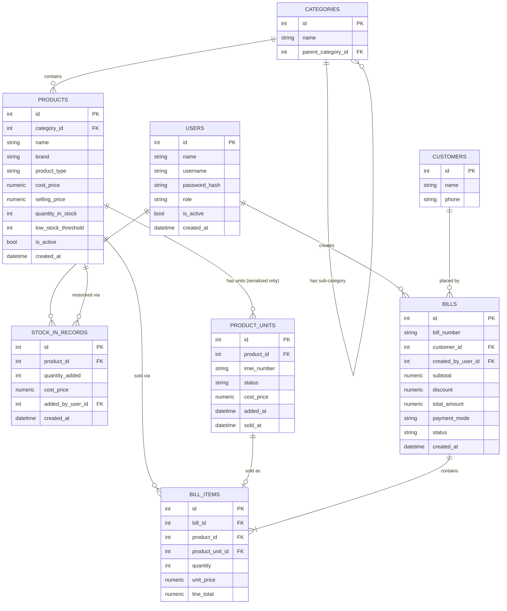

# Database Architecture Document
## Mobile Shop — Inventory, Billing & Sales Analytics System

**Version:** 1.0 (Draft for Review)
**Database:** PostgreSQL

---

## 1. Entity-Relationship Overview



## 2. Table Definitions

### 2.1 `users`
Stores both owner and staff accounts.

| Column | Type | Notes |
|---|---|---|
| id | SERIAL PK | |
| name | VARCHAR(100) | |
| username | VARCHAR(50) UNIQUE | |
| password_hash | VARCHAR(255) | bcrypt/argon2 hash, never plain text |
| role | VARCHAR(10) | `owner` or `staff` |
| is_active | BOOLEAN | default true; owner can deactivate staff instead of deleting |
| created_at | TIMESTAMP | |

### 2.2 `categories`
Self-referencing for sub-categories (e.g. "Accessories" → "Chargers").

| Column | Type | Notes |
|---|---|---|
| id | SERIAL PK | |
| name | VARCHAR(100) | |
| parent_category_id | INT, FK → categories.id, NULLABLE | NULL = top-level category |
| is_active | BOOLEAN | |

### 2.3 `products`
One row per product *type* (e.g. "iPhone 13 128GB Blue", or "Type-C Cable 1m"), regardless of how many units exist.

| Column | Type | Notes |
|---|---|---|
| id | SERIAL PK | |
| category_id | INT, FK → categories.id | |
| name | VARCHAR(150) | |
| brand | VARCHAR(50) | nullable |
| product_type | VARCHAR(15) | `serialized` or `quantity` |
| cost_price | NUMERIC(10,2) | owner-only visibility at the API layer |
| selling_price | NUMERIC(10,2) | |
| quantity_in_stock | INT | for `quantity` type, this is the live count. For `serialized` type, this is a **denormalized, auto-maintained count** of units with status `in_stock` (kept in sync via trigger or application logic, for fast dashboard reads) |
| low_stock_threshold | INT | default e.g. 2–5, configurable per product |
| is_active | BOOLEAN | |
| created_at, updated_at | TIMESTAMP | |

### 2.4 `product_units`
Only populated for `serialized` products (phones/tablets). One row per physical unit.

| Column | Type | Notes |
|---|---|---|
| id | SERIAL PK | |
| product_id | INT, FK → products.id | |
| imei_number | VARCHAR(20) UNIQUE | enforced unique across the whole table, not just per product |
| status | VARCHAR(10) | `in_stock`, `sold`, `returned`, `damaged` |
| cost_price | NUMERIC(10,2) | captured per-unit since cost can vary batch to batch |
| added_at | TIMESTAMP | |
| sold_at | TIMESTAMP | NULLABLE |

### 2.5 `stock_in_records`
Audit trail of every stock addition — the "history" the owner can review.

| Column | Type | Notes |
|---|---|---|
| id | SERIAL PK | |
| product_id | INT, FK → products.id | |
| quantity_added | INT | for serialized restocks, equals number of IMEIs added in that batch |
| cost_price | NUMERIC(10,2) | cost price at time of this batch |
| added_by_user_id | INT, FK → users.id | |
| created_at | TIMESTAMP | |

### 2.6 `customers`
Lightweight — optional capture at billing time.

| Column | Type | Notes |
|---|---|---|
| id | SERIAL PK | |
| name | VARCHAR(100) | nullable |
| phone | VARCHAR(15) | nullable, indexed for quick lookup |

### 2.7 `bills`
The bill header.

| Column | Type | Notes |
|---|---|---|
| id | SERIAL PK | |
| bill_number | VARCHAR(20) UNIQUE | human-readable sequential number, e.g. `INV-2026-0001` |
| customer_id | INT, FK → customers.id | NULLABLE |
| created_by_user_id | INT, FK → users.id | who billed it (owner or staff) |
| subtotal | NUMERIC(10,2) | |
| discount | NUMERIC(10,2) | default 0 |
| total_amount | NUMERIC(10,2) | |
| payment_mode | VARCHAR(15) | `cash`, `upi`, `card`, etc. |
| status | VARCHAR(10) | `completed` or `voided` |
| created_at | TIMESTAMP | also the basis for monthly analysis grouping |

### 2.8 `bill_items`
Line items per bill.

| Column | Type | Notes |
|---|---|---|
| id | SERIAL PK | |
| bill_id | INT, FK → bills.id | |
| product_id | INT, FK → products.id | |
| product_unit_id | INT, FK → product_units.id | NULLABLE — only set when selling a serialized unit |
| quantity | INT | always 1 for serialized items |
| unit_price | NUMERIC(10,2) | selling price captured **at time of sale** (so later price changes don't rewrite history) |
| line_total | NUMERIC(10,2) | quantity × unit_price |

## 3. Key Constraints & Integrity Rules

- `quantity_in_stock` on `products` must never go below 0 — enforced with a `CHECK (quantity_in_stock >= 0)` constraint as a safety net, in addition to application-level checks before the deduction.
- `product_units.imei_number` is globally unique — prevents the same phone being entered twice.
- Stock deduction + bill creation happens inside a **single database transaction**: if anything fails partway (e.g. one item in the cart is out of stock), the entire bill is rolled back — nothing is half-saved.
- Cost price fields (`products.cost_price`, `product_units.cost_price`, `stock_in_records.cost_price`) are excluded from any API response served to a `staff`-role token, regardless of which screen requests it.

## 4. Indexing Plan

| Table | Index | Reason |
|---|---|---|
| products | `(category_id)` | fast category-wise dashboard listing |
| products | `(name)` (trigram/GIN if using search) | fast product search during billing |
| product_units | `(imei_number)` UNIQUE | fast IMEI lookup at billing time |
| product_units | `(product_id, status)` | fast "how many in stock" counts |
| bills | `(created_at)` | monthly analysis queries group by date range |
| bill_items | `(bill_id)`, `(product_id)` | fast joins for bill detail and product-level sales totals |
| customers | `(phone)` | quick repeat-customer lookup |

## 5. Sample Queries for Monthly Analysis

**Total revenue and units sold this month:**
```sql
SELECT
    SUM(bi.line_total) AS total_revenue,
    SUM(bi.quantity) AS total_units_sold
FROM bills b
JOIN bill_items bi ON bi.bill_id = b.id
WHERE b.status = 'completed'
  AND b.created_at >= date_trunc('month', CURRENT_DATE)
  AND b.created_at < date_trunc('month', CURRENT_DATE) + interval '1 month';
```

**Category-wise breakdown for a given month:**
```sql
SELECT
    c.name AS category,
    SUM(bi.quantity) AS units_sold,
    SUM(bi.line_total) AS revenue
FROM bills b
JOIN bill_items bi ON bi.bill_id = b.id
JOIN products p ON p.id = bi.product_id
JOIN categories c ON c.id = p.category_id
WHERE b.status = 'completed'
  AND b.created_at >= date_trunc('month', CURRENT_DATE)
  AND b.created_at < date_trunc('month', CURRENT_DATE) + interval '1 month'
GROUP BY c.name
ORDER BY revenue DESC;
```

**Top 5 best-selling products this month:**
```sql
SELECT
    p.name,
    SUM(bi.quantity) AS units_sold,
    SUM(bi.line_total) AS revenue
FROM bills b
JOIN bill_items bi ON bi.bill_id = b.id
JOIN products p ON p.id = bi.product_id
WHERE b.status = 'completed'
  AND b.created_at >= date_trunc('month', CURRENT_DATE)
GROUP BY p.name
ORDER BY units_sold DESC
LIMIT 5;
```

Because every query above filters by `bills.created_at` and joins through `bill_items`, no separate "analytics" table is needed in v1 — the live transactional data answers these directly. If the product catalog grows very large later, these can be pre-aggregated into a `monthly_sales_summary` table refreshed nightly, but that's unnecessary for a single shop's data volume.
