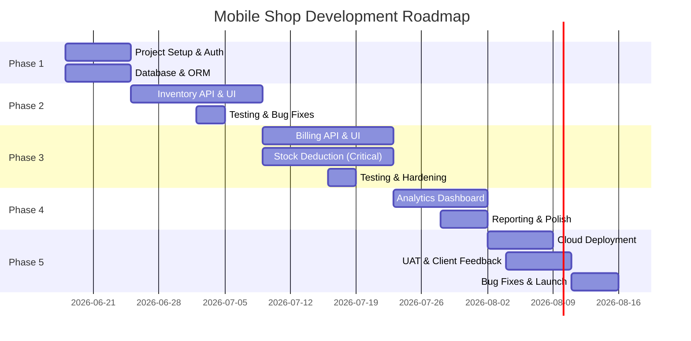

# Phase-Wise Work Distribution & Development Roadmap
## Mobile Shop — Inventory, Billing & Sales Analytics System

**Version:** 1.0 (Draft for Review)
**Total Estimated Duration:** 8–10 weeks (full-time development)
**Target Go-Live:** By end of August 2026

---

## Development Phases Overview



---

## Phase 1: Project Setup, Auth & Database (Week 1 — 7 days)

**Goal:** Get a working Next.js app with authentication, database schema, and basic project structure.

### Phase 1.1: Project Initialization

**Tasks:**
- [ ] Create Next.js 14 project with TypeScript
  - `npx create-next-app@latest mobile-shop --typescript --tailwind`
  - Remove boilerplate pages
  - Set up folder structure (`app/`, `components/`, `lib/`, `types/`, `hooks/`, `__tests__/`)

- [ ] Install key dependencies
  - `npm install prisma @prisma/client`
  - `npm install next-auth` (for NextAuth.js v5+)
  - `npm install recharts` (for charts)
  - `npm install zod` (for request validation, optional but recommended)
  - `npm install react-to-print` (for bill printing)
  - `npm install -D jest @testing-library/react @testing-library/jest-dom`

- [ ] Configure TypeScript, Tailwind, Jest
  - Verify `tsconfig.json` is set to strict mode
  - Configure `tailwind.config.js` with custom colors (low-stock red, sold green, etc.)
  - Create `jest.config.js` for unit testing

- [ ] Set up environment variables template
  - Create `.env.example` with placeholders for `DATABASE_URL`, `NEXTAUTH_SECRET`, `NEXTAUTH_URL`
  - Add `.env.local` to `.gitignore`

**Deliverable:** A clean Next.js project with dependencies installed, folder structure in place, ready for auth setup.

**Estimated Effort:** 1–2 days

---

### Phase 1.2: Authentication (NextAuth.js + JWT)

**Tasks:**
- [ ] Create `/lib/auth.ts` — NextAuth configuration
  - Configure Credentials provider (username/password)
  - Hash passwords using `bcryptjs` (install: `npm install bcryptjs`)
  - Set JWT secret and token expiry
  - Add role claim to token (`owner` or `staff`)
  - Create callback to attach role to session

- [ ] Create middleware for route protection
  - `/api/_middleware/rbac.ts` — Check user role before route handler runs
  - Reject staff users trying to access owner-only routes with 403

- [ ] Create login page `/app/(auth)/login/page.tsx`
  - Simple username + password form
  - Error handling for wrong credentials
  - Redirect to dashboard on success

- [ ] Create `/app/(dashboard)/layout.tsx` — Protected layout
  - Check `getServerSession()` — redirect to login if not authenticated
  - Show navbar + sidebar with role-based nav links
  - Logout button

- [ ] Create `hooks/useAuth.ts`
  - `const { user, role } = useAuth()` — get current session and role
  - `logout()` function

- [ ] Seed initial test user
  - Create Prisma seed function (we'll use this in Phase 1.3)
  - Owner account: `username: admin, password: password123` (obviously change in prod)
  - Staff account: `username: staff, password: password123`

**Deliverable:** A working login screen, protected dashboard pages, role-based access control.

**Estimated Effort:** 2–3 days

**Dependencies:** Database setup (Phase 1.3)

---

### Phase 1.3: Database Schema (Prisma)

**Tasks:**
- [ ] Create `prisma/schema.prisma` — Define all data models:
  - `User` (id, name, username, passwordHash, role, isActive, createdAt)
  - `Category` (id, name, parentCategoryId, isActive)
  - `Product` (id, categoryId, name, brand, productType, costPrice, sellingPrice, quantityInStock, lowStockThreshold, isActive, createdAt, updatedAt)
  - `ProductUnit` (id, productId, imeiNumber, status, costPrice, addedAt, soldAt)
  - `StockInRecord` (id, productId, quantityAdded, costPrice, addedByUserId, createdAt)
  - `Customer` (id, name, phone)
  - `Bill` (id, billNumber, customerId, createdByUserId, subtotal, discount, totalAmount, paymentMode, status, createdAt)
  - `BillItem` (id, billId, productId, productUnitId, quantity, unitPrice, lineTotal)

- [ ] Set up database connection
  - If using **Supabase:** Create a Supabase project, get `DATABASE_URL`
  - If using **local PostgreSQL:** Install Postgres locally, create a database
  - Add `DATABASE_URL` to `.env.local`

- [ ] Run initial migration
  - `npx prisma migrate dev --name init`
  - This creates the database and tables

- [ ] Set up Prisma client
  - Create `/lib/prisma.ts` — Singleton Prisma instance (prevents multiple connections in dev)
  - Use in API routes via `import { prisma } from '@/lib/prisma'`

- [ ] Seed dummy data (optional, but helpful for testing)
  - `prisma/seed.ts` — Create test categories, products, users
  - Run: `npx prisma db seed`
  - Data includes: 2 categories (Mobiles, Accessories), 5 sample products, owner + staff users

**Deliverable:** PostgreSQL database running, Prisma schema in place, migrations tracked in version control.

**Estimated Effort:** 2–3 days

---

### Phase 1 Checklist

- [ ] Next.js project created with TypeScript + Tailwind
- [ ] Dependencies installed (prisma, next-auth, recharts, etc.)
- [ ] Folder structure set up
- [ ] `.env.example` template created
- [ ] NextAuth configured with Credentials provider
- [ ] RBAC middleware in place
- [ ] Login page working
- [ ] Protected dashboard layout with role-aware navigation
- [ ] `useAuth` hook implemented
- [ ] PostgreSQL database created (local or Supabase)
- [ ] Prisma schema defined and migrated
- [ ] Test users seeded (admin, staff)
- [ ] `lib/prisma.ts` singleton in place

**End-of-Phase Verification:**
- Able to login as admin, see full nav
- Able to login as staff, see limited nav
- Dashboard page loads after login
- Session persists on refresh

**Before Moving to Phase 2:**
- Commit all code to Git
- Test login/logout flow manually

---

## Phase 2: Inventory Management (Week 2–3 — 14 days)

**Goal:** Build the entire inventory system — add stock, view products, filter by category, see low-stock alerts.

### Phase 2.1: Product & Category API Routes

**Tasks:**
- [ ] `GET /api/v1/categories` — List all categories (hierarchical)
  - Query Prisma: `category.findMany({ include: { children: true } })`
  - Response: `{ id, name, parentCategoryId, children: [...] }`
  - No authentication required, but staff can't see cost prices (handled at component level in v2, enforced at API in v2.5)

- [ ] `POST /api/v1/categories` — Create category (owner only)
  - Request: `{ name, parentCategoryId? }`
  - Validate: name is not empty
  - Response: created category or error

- [ ] `GET /api/v1/products` — List products (with filters)
  - Query params: `?categoryId=X&searchQ=Y&inStock=true&includeInactive=false`
  - **For staff tokens:** exclude `costPrice` from response
  - **For owner tokens:** include all fields
  - Join with `Product.category` and count `ProductUnit` where `status='in_stock'`
  - Paginate: return 20 per page by default

- [ ] `POST /api/v1/products` — Create product (owner only)
  - Request: `{ categoryId, name, brand, productType ('serialized'|'quantity'), costPrice, sellingPrice, lowStockThreshold }`
  - Validate: `sellingPrice >= costPrice`, `categoryId` exists, etc.
  - Response: created product with auto-generated ID

- [ ] `PATCH /api/v1/products/[id]` — Update product (owner only)
  - Updatable fields: `name`, `brand`, `costPrice`, `sellingPrice`, `lowStockThreshold`, `isActive`
  - Validate same rules as create

- [ ] `GET /api/v1/products/[id]` — Get single product detail (owner)
  - Include related data: category, all `ProductUnit` (if serialized), stock history
  - Return: `{ id, name, ..., category: {...}, units: [...], stockHistory: [...] }`

- [ ] `GET /api/v1/products/search` — Fast product search (for billing)
  - Query param: `?q=iphone`
  - Return first 10 matches (name or brand match)
  - Used during bill creation for quick product lookup

**Deliverable:** All product/category CRUD endpoints working, tested with Postman or curl.

**Estimated Effort:** 3–4 days

---

### Phase 2.2: Stock-In API Route (Add Inventory)

**Tasks:**
- [ ] `POST /api/v1/products/[id]/stock-in` — Add stock (owner only)
  - Request body:
    ```json
    {
      "type": "serialized",  // or "quantity"
      "data": {
        "imeis": ["123456789", "987654321"],  // for serialized
        // OR
        "quantity": 50,
        "costPrice": 15000
      }
    }
    ```
  - **For serialized products:**
    - Validate each IMEI is 15–20 chars
    - Check for duplicates in request
    - Query DB for duplicate IMEIs: `ProductUnit.findFirst({ where: { imeiNumber: ... } })`
    - Create `ProductUnit` entries with `status='in_stock'`
    - Create `StockInRecord` entry
    - Increment `Product.quantityInStock` by count of IMEIs
  - **For quantity products:**
    - Validate quantity > 0
    - Create single `StockInRecord` entry
    - Increment `Product.quantityInStock` by quantity
  - Enforce atomicity: all-or-nothing in a transaction

- [ ] `GET /api/v1/products/[id]/units` — List all units of a serialized product (owner)
  - Query: `ProductUnit.findMany({ where: { productId }, include: { bill_item: true } })`
  - Response: `[ { id, imeiNumber, status, costPrice, addedAt, soldAt }, ... ]`
  - Filter by status in query param: `?status=in_stock` or `?status=sold`

**Deliverable:** Can add stock via API, see IMEI list, audit trail shows who added what when.

**Estimated Effort:** 2–3 days

---

### Phase 2.3: Inventory UI Components & Pages

**Tasks:**
- [ ] Create `/app/(dashboard)/inventory/page.tsx`
  - Shows list of all products in a table
  - Columns: Product Name, Brand, Category, Quantity in Stock, Status (in stock / low / out of stock), Actions (View, Edit, Add Stock)
  - Filters: Category dropdown, search by name
  - Low-stock alert badge (red for qty < threshold)

- [ ] Create `/app/(dashboard)/inventory/[id]/page.tsx` — Product detail
  - Show: name, brand, category, cost price (owner only), selling price, current qty in stock
  - Stock history table: "Added X units on [date] by [user]" or list of IMEIs
  - "Edit Product" button (owner only)
  - "Add Stock" button (owner only) — navigates to add-stock form

- [ ] Create `/app/(dashboard)/inventory/add-stock/page.tsx`
  - Step 1: Select category dropdown
  - Step 2: Select product from category
  - Step 3: Choose stock type (Serialized = IMEI, Quantity = number)
  - Step 4: Enter data
    - If serialized: textarea for IMEI list (one per line), cost price
    - If quantity: input for quantity, cost price
  - Step 5: Review & submit button
  - On success: show confirmation + redirect to product detail

- [ ] Create components:
  - `components/inventory/ProductList.tsx` — Table of products
  - `components/inventory/ProductCard.tsx` — Card view for mobile
  - `components/inventory/AddStockForm.tsx` — Multi-step form
  - `components/inventory/CategoryFilter.tsx` — Category dropdown + breadcrumb
  - `components/inventory/LowStockAlert.tsx` — Badge component
  - `components/inventory/StockInHistory.tsx` — Table of stock additions

- [ ] Create `hooks/useProducts.ts`
  - `useProducts.list(categoryId?, searchQ?)` — GET /api/v1/products
  - `useProducts.create(data)` — POST /api/v1/products
  - `useProducts.update(id, data)` — PATCH /api/v1/products/[id]
  - `useProducts.getById(id)` — GET /api/v1/products/[id]

- [ ] Create `hooks/useCategories.ts`
  - `useCategories.list()` — GET /api/v1/categories
  - `useCategories.create(data)` — POST /api/v1/categories

- [ ] Create `hooks/useStockIn.ts`
  - `useStockIn.addIMEIs(productId, imeis, costPrice)`
  - `useStockIn.addQuantity(productId, quantity, costPrice)`

- [ ] Create `components/ui/` components (if not already done)
  - `Input.tsx`, `Button.tsx`, `Select.tsx`, `Modal.tsx`, `Badge.tsx`, `Table.tsx`, `Spinner.tsx`, `Toast.tsx`

**Deliverable:** Fully functional inventory UI — can view products, filter by category, add stock, see history.

**Estimated Effort:** 4–5 days

---

### Phase 2.4: Testing & Bug Fixes

**Tasks:**
- [ ] Write unit tests for API routes
  - `__tests__/api/products.test.ts` — Test GET, POST, PATCH
  - `__tests__/api/stock-in.test.ts` — Test adding serialized vs quantity, duplicate IMEI validation
  - Test RBAC: staff should not be able to create products or add stock

- [ ] Write component tests
  - `__tests__/components/inventory/ProductList.test.tsx` — Render, test filtering, sorting
  - `__tests__/components/inventory/AddStockForm.test.tsx` — Test form submission, error states

- [ ] Manual testing
  - Login as owner → add a category → add a product → add stock (IMEI + Quantity) → verify in inventory list
  - Login as staff → view inventory (can see, but no "add stock" button) → verify no cost price shown
  - Low-stock threshold: set threshold to 10, add 5 units, verify red badge appears

- [ ] Bug fixes from manual testing
  - Handle edge cases: empty search, no products, IMEI duplicates, negative quantities

**Deliverable:** Phase 2 feature-complete, tested, no critical bugs.

**Estimated Effort:** 2–3 days

---

### Phase 2 Checklist

- [ ] Category CRUD endpoints working
- [ ] Product CRUD endpoints working
- [ ] Stock-in API (IMEI + Quantity) working, tested for duplicates
- [ ] ProductUnit list endpoint for serialized products
- [ ] Product list page with filtering & search
- [ ] Product detail page with stock history
- [ ] Add stock form (multi-step, supports both types)
- [ ] Low-stock alerts visible
- [ ] Unit tests for API routes (>80% coverage)
- [ ] Component tests for UI
- [ ] Manual end-to-end testing done
- [ ] No RBAC violations (staff can't add stock, see cost prices)

**End-of-Phase Verification:**
- Owner can: add category, add product, add stock (both serialized & quantity), view history
- Staff can: see products, search, but not modify or see cost prices
- Dashboard shows low-stock alerts
- All tests pass

---

## Phase 3: Billing & Stock Deduction (Week 4–5 — 14 days)

**Goal:** Build the point-of-sale system with atomic stock deduction — the most critical feature.

### Phase 3.1: Bill API Routes (Core Transaction Logic)

**Tasks:**
- [ ] `POST /api/v1/bills` — Create bill (owner & staff)
  - **Request:**
    ```json
    {
      "items": [
        { "productId": 1, "quantity": 1, "productUnitId": 5 },  // serialized
        { "productId": 2, "quantity": 3 }  // quantity-based
      ],
      "customerId": null,  // or existing customer ID
      "customerName": "John Doe",
      "customerPhone": "9876543210",
      "discount": 500,
      "paymentMode": "cash"
    }
    ```
  - **Database Transaction (CRITICAL):**
    ```
    BEGIN TRANSACTION
      1. Lock product rows being sold (avoid race condition)
      2. Verify each product has sufficient quantity
      3. Create bill entry with status='completed'
      4. Create bill_items entries
      5. For each item:
         - Decrement product.quantityInStock
         - For serialized items: mark ProductUnit.status='sold', set sold_at
      6. COMMIT
    ```
  - If any step fails, entire transaction rolls back → bill never created, stock unchanged
  - Generate sequential bill number: `INV-2026-0001`, increment each bill
  - **For staff tokens:** ensure cost price is never logged/returned

- [ ] `GET /api/v1/bills` — List bills (pagination)
  - Query params: `?limit=20&offset=0&status=completed&month=2026-06`
  - Return: `[ { id, billNumber, customerName, totalAmount, createdAt, createdBy }, ... ]`

- [ ] `GET /api/v1/bills/[id]` — Get single bill (viewable by creator or owner)
  - Return full bill with all line items, customer info, totals

- [ ] `POST /api/v1/bills/[id]/void` — Cancel bill (owner only, same day only)
  - Check bill.createdAt is today (or within X hours, configurable)
  - **Reverse Transaction:**
    ```
    BEGIN TRANSACTION
      1. For each bill_item:
         - Increment product.quantityInStock
         - For serialized: set ProductUnit.status='in_stock', clear sold_at
      2. Update bill.status='voided'
      3. COMMIT
    ```
  - Log reason for void (optional, for audit)

**Deliverable:** Bills can be created with atomic stock deduction, voided with stock restored, no race conditions.

**Estimated Effort:** 3–4 days (this is the most critical logic)

---

### Phase 3.2: Billing UI Components & Pages

**Tasks:**
- [ ] Create `/app/(dashboard)/billing/page.tsx` — POS interface
  - Split screen:
    - **Left:** Product search + cart (list of items selected)
    - **Right:** Bill summary (subtotal, discount, total) + finalize button
  - Responsive layout (works on tablet at counter)

- [ ] Create `/app/(dashboard)/billing/cart/page.tsx` — Bill preview before finalize
  - Show all line items with price breakdown
  - Option to remove items or adjust quantity (quantity items only)
  - Option to add customer info (name, phone)
  - "Finalize Bill" button → creates transaction
  - On success: show printable bill + option to print/email

- [ ] Create `/app/(dashboard)/billing/history/page.tsx` — Past bills
  - Table of bills created today/this week/this month
  - Filter by date range, customer name, payment mode
  - Click bill → view/print receipt
  - Owner can void bills (shows confirmation warning about same-day-only)

- [ ] Create components:
  - `components/billing/ProductSearch.tsx` — Search + autocomplete
  - `components/billing/BillCart.tsx` — Items in current bill
  - `components/billing/BillItem.tsx` — Single line item
  - `components/billing/BillPreview.tsx` — Final summary before submit
  - `components/billing/CustomerInfoForm.tsx` — Name + phone capture
  - `components/billing/BillPrintable.tsx` — Invoice layout (formatted for print)
  - `components/billing/PaymentModeSelect.tsx` — Cash / UPI / Card selector

- [ ] Create `hooks/useBills.ts`
  - `useBills.create(items, customerId, discount, paymentMode)` — POST /api/v1/bills
  - `useBills.getById(id)` — GET /api/v1/bills/[id]
  - `useBills.list(filters)` — GET /api/v1/bills
  - `useBills.void(id)` — POST /api/v1/bills/[id]/void

- [ ] Implement `lib/db-transactions.ts`
  - `createBillWithStockDeduction(items, ...)` — wrapper around the atomic transaction
  - `voidBillAndRestoreStock(billId, reason)`
  - Both use Prisma `$transaction()` to ensure atomicity

- [ ] Printing via `react-to-print`
  - Button to print invoice, triggers browser print dialog
  - `BillPrintable` component formats receipt nicely

**Deliverable:** Complete POS system, can bill customers, print receipts, void bills.

**Estimated Effort:** 3–4 days

---

### Phase 3.3: Stock Deduction Testing (Critical)

**Tasks:**
- [ ] Unit tests for transaction logic
  - `__tests__/api/bills.test.ts`
  - Test: create bill → stock decrements correctly
  - Test: void bill → stock restored correctly
  - Test: concurrent bills trying to sell last unit → only one succeeds, other gets "out of stock"
  - Test: staff can bill but can't see cost prices in request/response

- [ ] Test serialized vs quantity behavior
  - Serialized: verify ProductUnit.status changes to 'sold'
  - Quantity: verify quantityInStock decrements

- [ ] Edge case testing
  - Sell exact quantity (qty=stock) → should succeed, stock becomes 0
  - Try to sell more than available → should fail, stock unchanged
  - Two requests at same time for last unit → race condition test (DB locking should handle this)
  - Negative quantities in request → should be rejected

- [ ] Manual end-to-end testing
  - As staff: search product → add to cart → finalize → verify bill created + stock decremented
  - As owner: create bill → verify bill visible in history → void it → verify stock restored
  - Print a bill, verify format looks good

**Deliverable:** Stock deduction is bulletproof, no edge cases, race conditions handled.

**Estimated Effort:** 2–3 days

---

### Phase 3.4: Bug Fixes & Polish

**Tasks:**
- [ ] Fix any issues from testing
- [ ] Improve error messages (show which product is out of stock, not just generic "bill failed")
- [ ] Add loading spinners during bill creation (may take 1–2 seconds with DB transaction)
- [ ] Add confirmation modal before finalizing bill ("Are you sure?")
- [ ] Toast notifications: "Bill created successfully!", "Out of stock", etc.

**Deliverable:** Phase 3 complete, all tests passing, no critical bugs.

**Estimated Effort:** 1–2 days

---

### Phase 3 Checklist

- [ ] Bill creation API with atomic stock deduction
- [ ] Bill void API with stock restoration
- [ ] Sequential bill number generation (INV-2026-0001, etc.)
- [ ] Billing UI with product search
- [ ] Cart + bill preview
- [ ] Customer info capture (optional)
- [ ] Printable receipt via react-to-print
- [ ] Bill history view + void button (owner only)
- [ ] Transaction tests for concurrent billing
- [ ] Edge case tests (overselling, race conditions)
- [ ] Manual end-to-end testing
- [ ] Loading spinners + error handling

**End-of-Phase Verification:**
- Staff can bill 10 customers without stock going negative
- Two staff members try to sell last item → only one succeeds
- Void a bill → stock restored, transaction logged
- Print a receipt → format is clean and readable
- All tests pass, >80% API coverage

---

## Phase 4: Analytics Dashboard (Week 6 — 10 days)

**Goal:** Build the monthly sales analysis dashboard — owner's KPI view.

### Phase 4.1: Analytics API Routes

**Tasks:**
- [ ] `GET /api/v1/analytics/monthly?month=2026-06` — Get monthly sales (owner only)
  - Query: aggregate `bills` + `bill_items` for the given month
  - Return:
    ```json
    {
      "month": "2026-06",
      "totalRevenue": 125000,
      "totalUnitsSold": 45,
      "categories": [
        { "name": "Mobiles", "units": 15, "revenue": 90000 },
        { "name": "Accessories", "units": 30, "revenue": 35000 }
      ],
      "topProducts": [
        { "id": 1, "name": "iPhone 13", "units": 10, "revenue": 80000 },
        { "id": 2, "name": "Type-C Cable", "units": 25, "revenue": 10000 }
      ],
      "comparison": {
        "previousMonth": "2026-05",
        "prevRevenue": 100000,
        "prevUnits": 40,
        "revenueGrowth": "+25%",
        "unitsGrowth": "+12.5%"
      }
    }
    ```
  - Sample queries:
    ```sql
    SELECT SUM(bi.line_total) as revenue, SUM(bi.quantity) as units
    FROM bills b JOIN bill_items bi ON b.id = bi.bill_id
    WHERE b.status='completed' AND b.created_at >= date_trunc('month', ...)
    ```

- [ ] Optional: `GET /api/v1/analytics/daily` — Daily sales trend (for chart)
  - Return sales per day for the month
  - Used for line chart visualization

**Deliverable:** Analytics endpoint returning all needed data, efficient queries.

**Estimated Effort:** 1–2 days

---

### Phase 4.2: Analytics UI Components & Page

**Tasks:**
- [ ] Create `/app/(dashboard)/analytics/page.tsx`
  - Month selector (dropdown or calendar picker)
  - Show KPI cards: Total Revenue, Total Units, Comparison to last month (% change)
  - Line chart: revenue trend over the month (daily)
  - Pie/bar chart: category-wise breakdown
  - Table: top 10 products

- [ ] Create components:
  - `components/analytics/MonthSelector.tsx` — Month picker (or prev/next buttons)
  - `components/analytics/RevenueChart.tsx` — Line chart using Recharts
  - `components/analytics/CategoryBreakdown.tsx` — Pie chart or horizontal bar
  - `components/analytics/TopProducts.tsx` — Table of top sellers
  - `components/analytics/ComparisonCard.tsx` — This month vs last month cards
  - `components/analytics/KPICard.tsx` — Reusable metric card

- [ ] Create `hooks/useAnalytics.ts`
  - `useAnalytics.getMonthly(month)` — GET /api/v1/analytics/monthly

- [ ] Styling for charts (via Tailwind)
  - Recharts is lightweight, integrates well with Tailwind colors

**Deliverable:** Full analytics dashboard, all charts working, data updates when month changes.

**Estimated Effort:** 2–3 days

---

### Phase 4.3: Testing & Reporting

**Tasks:**
- [ ] Unit tests for analytics queries
  - `__tests__/api/analytics.test.ts`
  - Create mock bills, query analytics, verify calculations are correct

- [ ] Component tests for charts
  - Render components, verify data is displayed
  - Test month selector changes data

- [ ] Manual testing
  - Create bills in different months
  - View analytics, verify totals match manual count
  - Compare month-to-month growth percentages

- [ ] Performance check
  - If the DB has 1000+ bills, does the analytics query still complete in <1s?
  - If too slow, consider caching or a summary table (v2 optimization)

**Deliverable:** Analytics dashboard tested, no performance issues.

**Estimated Effort:** 1–2 days

---

### Phase 4.4: Polish & Refinement

**Tasks:**
- [ ] Export analytics to CSV (optional, nice-to-have)
- [ ] Better date formatting (e.g., "June 2026" instead of "2026-06")
- [ ] Responsive charts (look good on mobile)
- [ ] Loading states while fetching analytics data
- [ ] Error handling (no bills = show empty state gracefully)

**Deliverable:** Phase 4 complete, polished analytics dashboard.

**Estimated Effort:** 1 day

---

### Phase 4 Checklist

- [ ] Analytics monthly aggregation API
- [ ] Daily sales trend endpoint (optional)
- [ ] Analytics dashboard page
- [ ] Month selector
- [ ] KPI cards (revenue, units, comparison)
- [ ] Revenue trend chart (Recharts)
- [ ] Category breakdown (pie/bar chart)
- [ ] Top products table
- [ ] Unit tests for aggregation logic
- [ ] Manual verification of calculations
- [ ] Responsive design

---

## Phase 5: Cloud Deployment & UAT (Week 7–8 — 12 days)

**Goal:** Deploy to production, collect client feedback, fix issues, go live.

### Phase 5.1: Cloud Setup & Deployment

**Tasks:**
- [ ] Prepare Supabase (if not already done)
  - Create Supabase project
  - Run migrations: `DATABASE_URL=... npx prisma migrate deploy`
  - Seed production data (categories, initial products)

- [ ] Deploy to Vercel
  - Connect GitHub repo to Vercel
  - Set environment variables in Vercel dashboard:
    - `DATABASE_URL` (Supabase)
    - `NEXTAUTH_SECRET` (generate via `openssl rand -base64 32`)
    - `NEXTAUTH_URL` (Vercel deployment URL)
  - Push code → Vercel auto-deploys
  - Test: login, add stock, bill, analytics all work on live URL

- [ ] Domain & SSL (if client has custom domain)
  - Point client's domain to Vercel (DNS changes)
  - Vercel auto-provisions SSL certificate

- [ ] Backup & monitoring
  - Set up Supabase automated backups
  - Enable query monitoring (Supabase dashboard)

**Deliverable:** App live on Vercel with Supabase backend, all HTTPS.

**Estimated Effort:** 2 days

---

### Phase 5.2: UAT & Client Feedback

**Tasks:**
- [ ] Share live URL with client (owner + 1 staff member for testing)
- [ ] Provide testing checklist:
  - [ ] Login (owner & staff accounts)
  - [ ] Add a new product category
  - [ ] Add 5 products with various quantities
  - [ ] Add stock to 2 products (both IMEI and quantity)
  - [ ] Create 3 test bills (as staff)
  - [ ] Void 1 bill and verify stock restored
  - [ ] View monthly analytics
  - [ ] Print a bill
  - [ ] Try edge cases: sell more than available, add duplicate IMEI

- [ ] Collect feedback on:
  - Usability — any confusing flows?
  - Performance — do things feel fast?
  - Missing features — anything critical we forgot?
  - Data accuracy — do numbers match what they expect?

- [ ] Bug tracking & triage
  - Create issues for any bugs reported
  - Prioritize: critical (blocks core flow), high (incorrect data), medium (cosmetic)

**Deliverable:** Client feedback collected, issues logged.

**Estimated Effort:** 2–3 days

---

### Phase 5.3: Bug Fixes & Refinements

**Tasks:**
- [ ] Fix critical bugs (e.g., stock not decrementing, password reset issues)
- [ ] Fix high-priority bugs (e.g., chart formatting, search not working)
- [ ] Fix medium-priority cosmetic issues
- [ ] Implement quick feature requests (e.g., "can we show cost price on owner's bill view?")
- [ ] Re-test fixes with client

**Deliverable:** All critical/high bugs fixed, client re-tests and approves.

**Estimated Effort:** 2–3 days

---

### Phase 5.4: Go-Live & Training

**Tasks:**
- [ ] Final checklist before launch:
  - [ ] All tests passing
  - [ ] No critical bugs open
  - [ ] Client sign-off on UAT
  - [ ] Database backups configured
  - [ ] Admin contact info for incident response
  - [ ] Documentation for staff on how to use app (can be simple 1-page guide)

- [ ] Provide training to owner & staff (1–2 hour session)
  - Walk through login, dashboard, inventory, billing, analytics
  - Q&A

- [ ] Monitor first week
  - Check error logs daily
  - Be available for urgent questions

**Deliverable:** App live, client trained, initial support period.

**Estimated Effort:** 1–2 days (mostly training)

---

### Phase 5 Checklist

- [ ] Supabase production database set up
- [ ] Production migrations applied
- [ ] Vercel deployment configured
- [ ] Environment variables set
- [ ] Custom domain (if applicable)
- [ ] SSL certificate active
- [ ] Client UAT completed
- [ ] Critical bugs fixed
- [ ] Client sign-off obtained
- [ ] Staff training provided
- [ ] Documentation created (basic user guide)
- [ ] Monitoring/backups configured

---

## Post-Launch: Roadmap for Phase 2 (Future)

Once v1 is live and stable, consider these features:

### High-Value Additions
- **Returns & Refunds:** Track returned items, restock them
- **Supplier Management:** Track purchase orders, costs, lead times
- **Warranty Tracking:** Flag phones sold with warranty expiry dates
- **GST Compliance:** Tax-compliant invoices if client's taxes change
- **SMS/WhatsApp Bills:** Send receipts via WhatsApp (integrate Twilio)
- **Barcode Scanning:** Hardware integration for faster billing

### Infrastructure Improvements
- **Caching:** Redis for frequently accessed product lists
- **Search:** Full-text search (Postgres FTS) for better product discovery
- **Analytics Summaries:** Pre-compute monthly summaries nightly (if DB grows large)
- **Reporting:** Export to PDF, email reports to owner
- **Multi-User Concurrency:** Handle 2+ staff members billing simultaneously (already safe, just scale if needed)

### Monitoring & Observability
- **Error Tracking:** Sentry integration for production errors
- **Analytics:** Google Analytics for understanding user behavior
- **Performance Monitoring:** Datadog or similar to track API latencies

---

## Risk Mitigation

| Risk | Mitigation |
|---|---|
| **Stock count bugs** | Extensive testing in Phase 3.3, transaction atomicity, regular DB audits |
| **Performance degradation** | Indexing strategy set up (Phase 1), query monitoring in Phase 5 |
| **Data loss** | Supabase automated backups, Version control for code |
| **Concurrent billing race conditions** | Database row-level locking in transactions, tested in Phase 3.3 |
| **Staff seeing cost prices** | API layer filtering for staff tokens, enforced in middleware, not just UI |
| **Scope creep** | Strict feature gate: Phase 1 auth, Phase 2 inventory, Phase 3 billing, Phase 4 analytics. Phase 2 features reserved for v2. |

---

## Success Metrics (By End of Phase 5)

- ✅ Zero stock count discrepancies between system and physical inventory
- ✅ Bill creation time: <5 seconds per transaction (staff trained, system optimized)
- ✅ Owner can answer "How much did I sell this month and of what?" in 10 seconds (analytics dashboard)
- ✅ Zero unplanned downtime in first month
- ✅ Staff can use system with <1 hour training
- ✅ All tests passing, code coverage >80% for critical paths (auth, billing, stock deduction)

---

## Timeline Summary

| Phase | Duration | Key Deliverable |
|---|---|---|
| **Phase 1** | Week 1 (7 days) | Next.js project, auth, database schema |
| **Phase 2** | Weeks 2–3 (14 days) | Full inventory management |
| **Phase 3** | Weeks 4–5 (14 days) | Billing with atomic stock deduction |
| **Phase 4** | Week 6 (10 days) | Analytics dashboard |
| **Phase 5** | Weeks 7–8 (12 days) | Cloud deployment, UAT, go-live |
| **Total** | 8–10 weeks | **Live production system** |

**Estimated timeline:** Start June 18, 2026 → Go-live by mid-August 2026.

---

## Getting Started (Next Steps)

1. **After sign-off on this document:**
   - Confirm client agrees with scope & timeline
   - Confirm tech stack (Next.js, Prisma, PostgreSQL, Supabase, Vercel)
   - Set up Supabase project and get `DATABASE_URL`

2. **Week 1 kickoff:**
   - Create Next.js project
   - Set up folder structure
   - Begin Phase 1.1 (project init) → Phase 1.2 (auth) → Phase 1.3 (database)

3. **Weekly check-ins:**
   - Review completed tasks
   - Adjust timeline if needed
   - Demo features to client (every 2 weeks starting Week 3)

4. **Go-live readiness:**
   - By end of Week 5: core system fully tested
   - Weeks 6–8: polish, deployment, UAT, launch

Good luck! 🚀
